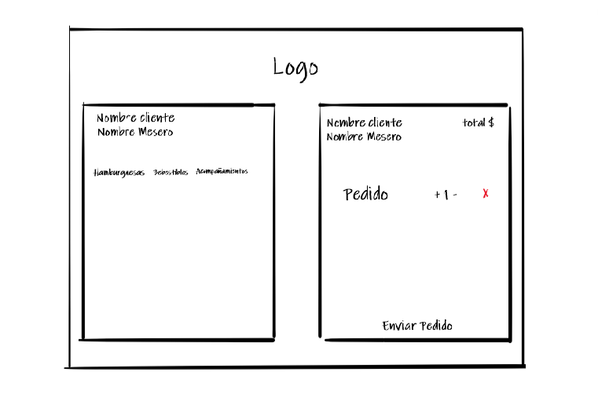
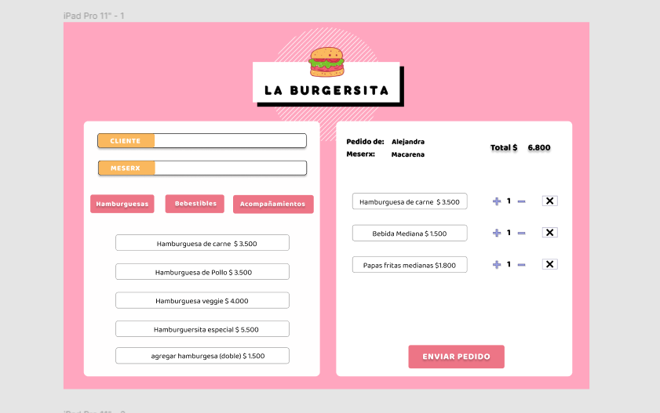
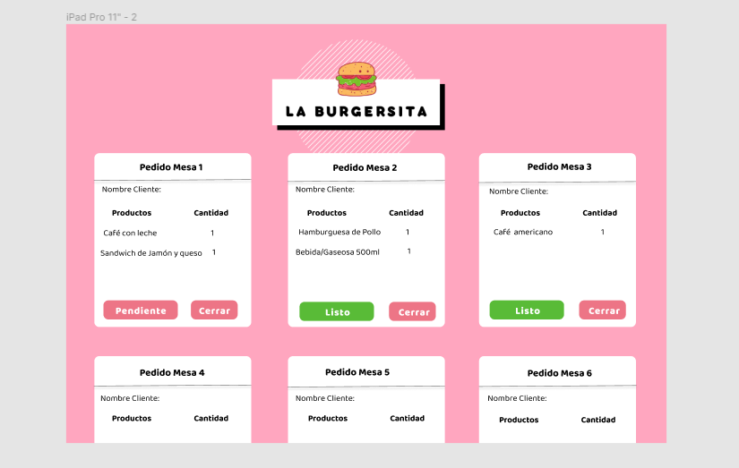
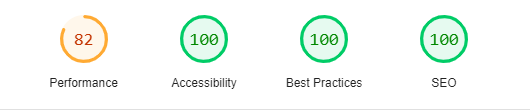

# La Burgersita

## Resumen del proyecto

Nuestra app esta desarrollada para el local de hamburguesas "La Burgersita" donde la principal función es facilitar la interacción entre meserxs y cocinerxs ante los pedidos de los clientes.

## Interfaz de la Aplicación

Diseñada para utilizar en dispositivos tablets y de escritorio ya que son los más utilizados en restaurantes y locales de comida.
La App cuenta con tres tipos de menús; Desayuno, Principal y Bebestibles. En donde se desplieguan diferentes productos, el meserx solo debe hacer click en uno de estos y se agregaran al pedido. Al enviarlo, este llega directamente a la sección de Cocina donde el chef los puede ver e ir indicando cual esta listo para servir y asi el meserx pueda llevar la orden a la mesa y cerrar el pedido.

## Desarrollo de la app

### Historias de Usuarios

Nuestro proyecto se basó en dos Historias de Usuarios:

#### [Historia de usuario 1] Mesero/a debe poder tomar pedido de cliente

_Yo como meserx quiero tomar el pedido de un cliente para no depender de mi mala memoria, para saber cuánto cobrar, y enviarlo a la cocina para evitar errores y que se puedan ir preparando en orden._

#### [Historia de usuario 2] Jefe de cocina debe ver los pedidos

_Yo como jefx de cocina quiero ver los pedidos de los clientes en orden y marcar cuáles están listos para saber qué se debe cocinar y avisar a lxs meserxs que un pedido está listo para servirlo a un cliente._

### Planificación

Para la planificación del proyecto y en base a las historias de usuarios detalladas, utilizamos GitHub Proyects

[Proyecto Burger Queen - La Burgersita](https://github.com/MacarenaRivera/SCL018-burger-queen/projects/1)

### Diseño

Realizamos dos tipos de prototipos, el primero de baja fidelidad en base a la Historia de usuario 1.

Luego, realizamos los prototipos de alta fidelidad en Figma en base a la Historia de usuario 1 y 2.

## Condiciones Generales

### Informe de Lighthouse

Nuestra app fue testeada obteniendo los siguientes resultados;

### Herramientas utilizadas

- React
- JavaScript
- Css
- Html
- Firebase
- Sweetalert2
- Sweetalert2-react-content

### Creadoras

Esta aplicación fue desarrollada por Alejandra Maureira y Macarena Rivera.

### Link de Página web

[La Burgersita](https://burger-queen-ma-22d5b.web.app/)
